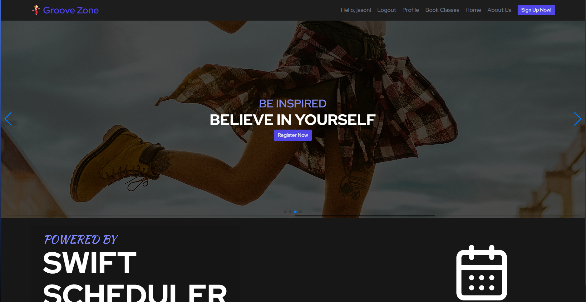
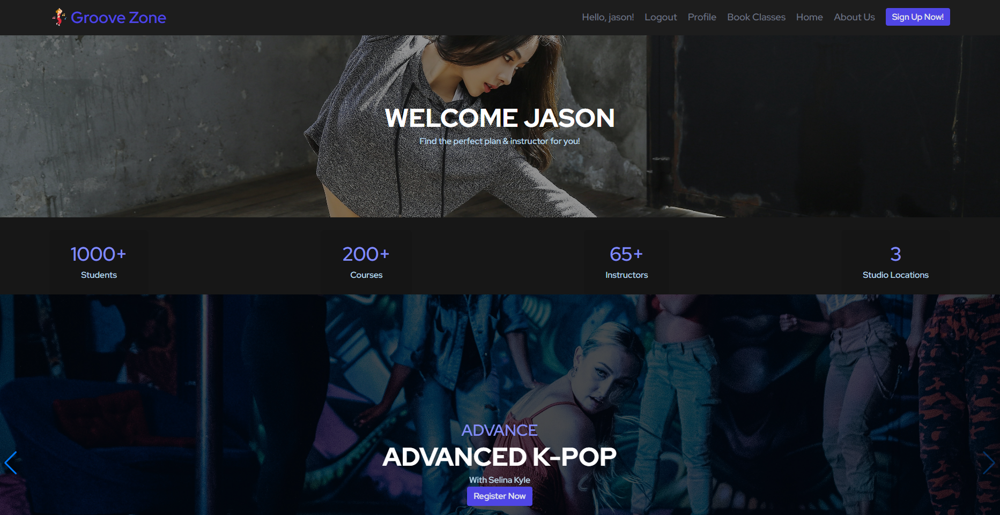
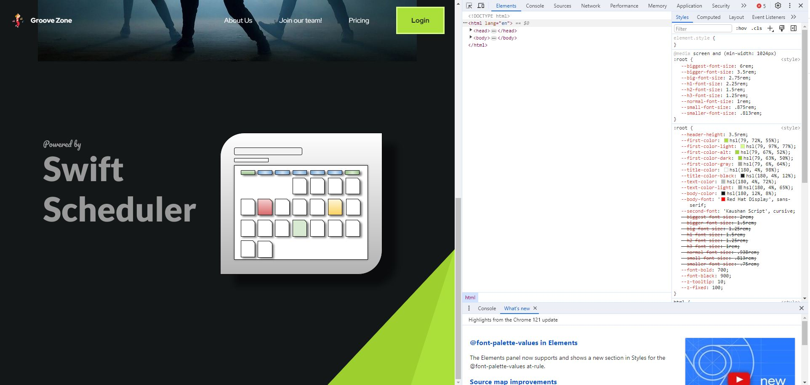
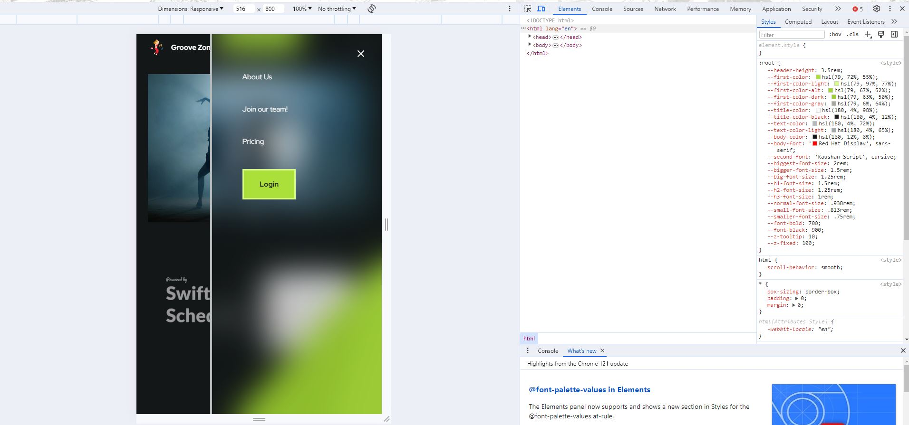
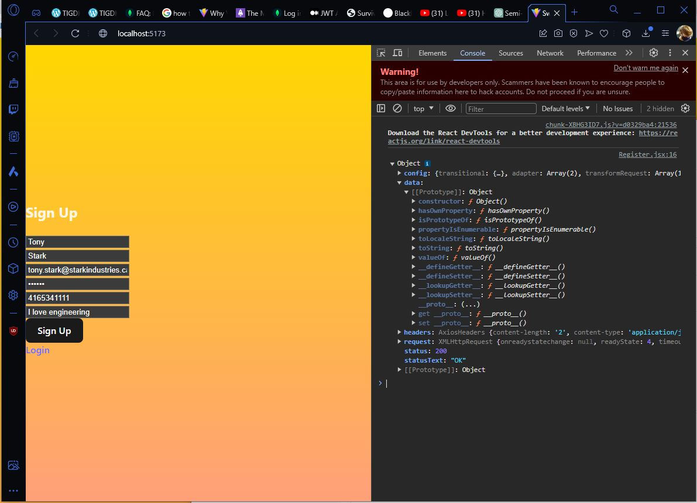
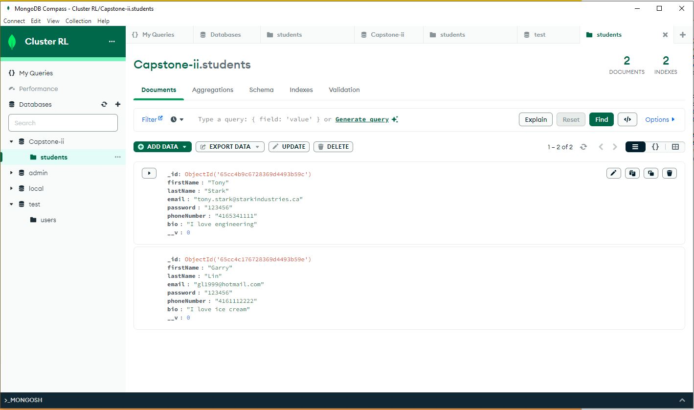

# Dev Notes

Hello Ryan here! This section of the repo is made just to log the entire development journey from all the milestones and setbacks I encounter. I'll try to be as open/transparent and frequent with these updates as the project progresses.

## Dev Log - 03/16/2024

After a couple of group sprints, I've learned to value communication more as so many merge conflicts could had been easily resolved through simple conversations and a centralized directory structure. After many hours I was able to merge my CSS stying with tailwind to match my partner's code. Here are the new updated landing page with a dynamic navigation bar.

**Landing Page**
 

**Home Page**
 

As for the upcomming days, the tasks that needs to be completed for the front end are as followed

**Front-end** 
* Calendar Feature - Venus
    * Shift Posting Feature - Ryan/Ven
    * About Page - Venus
    * Home Page - Ryan
        * Welcome Banner with user's name **DONE**
        * Promotion Slides of upcomming and ongoing courses
        * Upcomming Classes Component
            * List View
            * Holds cards with user's classes: Name, Teacher, Time, Date
            * Date must be within one month from current date 
        * Previous Classes Component
            * List View
            * Holds cards with user's classes: Name, Teacher, Time, Date
            * Date must be past the current date 

## Dev Log - 02/19/2024

I'm embarrassed to admit how long it took me just to read over the css files and cross reference every div tag with their respective classNames. I tried my hand at tailwind.css but was unfruitful. Maybe I'll try again in the future but for now normal css stylesheets will suffice. I was able to conjure up a basic template for the landing page, complete a functional navigation bar at certain screen resolutions. 

Our groups Sprint 5 presentation is 4 days away as of writting and the workload seems manageable. Hopefully we'll have 2 screens functional & rehearse a skit when presentation day comes! 

Here are some prototype early development webpages I authored for the project!

**Wide Resolution**

**Narrow Resolution**

## Dev Log - 02/13/2024

I couldn't get any of my group members code to run on my local machine so I remade it all from scratch and salvaged what I deemed usable (model folder for all the schemas, and the dockerfile). I'll be setting up a simple front-end registration, login and sign up page, API calls, and Routes myself

I finished the basic routing for 3 pages as of today register, login, and homepage for students and was able to have front end post all the data into my mongodb database via tables and schema

Here is my registration page with a successful post request

and here is my mongodb database, table and schema

